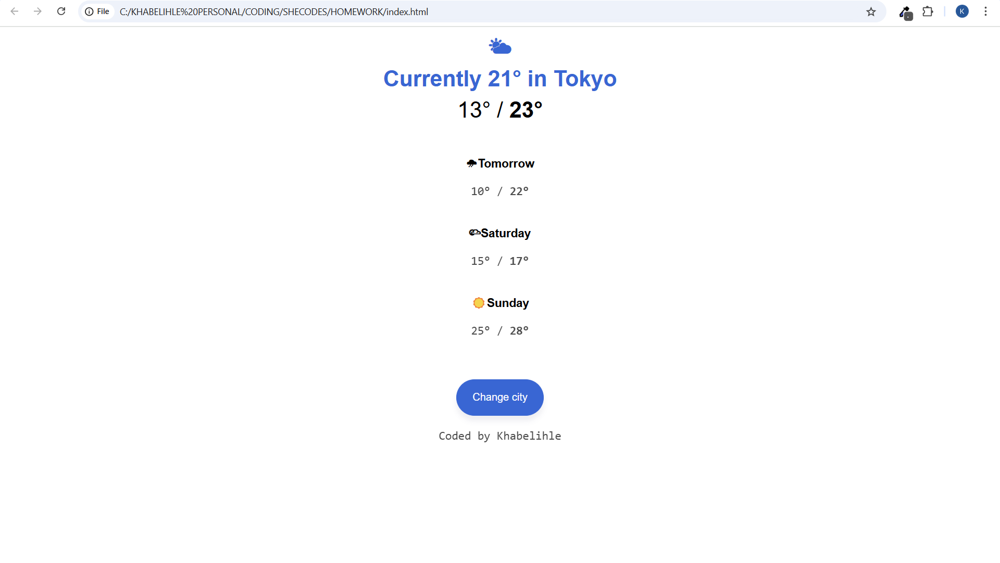

# Weather App 🌤️

  
  

A clean and simple weather forecast app built with HTML and CSS.

---

## Features

- Displays current weather conditions for Tokyo  
- Shows a 3-day forecast with highs and lows  
- Interactive hover effects on forecast cards

---

## Technologies

- HTML5  
- CSS3

---

## Live Demo

Try it out here: [Weather App Live](https://khabelihle-zuma.github.io/weather-app/)

---

## Screenshot

---

## Future Improvements

- Integrate real-time weather data using a public API  
- Make the app fully responsive for all device sizes  
- Add JavaScript to allow users to change the city

---

## Author

Khabelihle Zuma  
[GitHub Profile](https://github.com/Khabelihle-Zuma)
